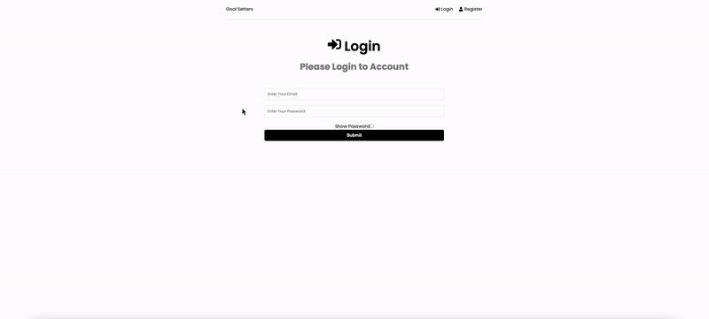
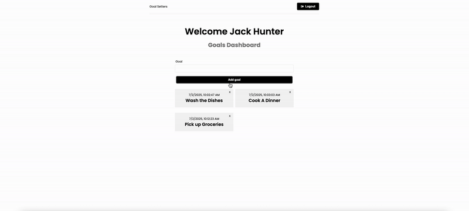
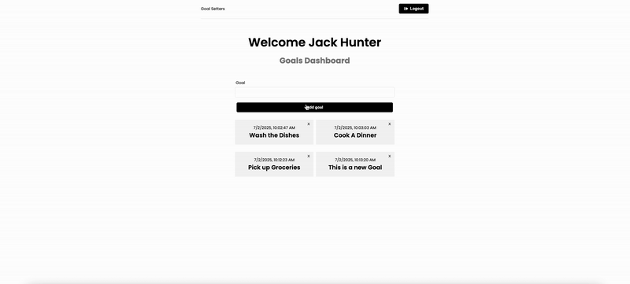
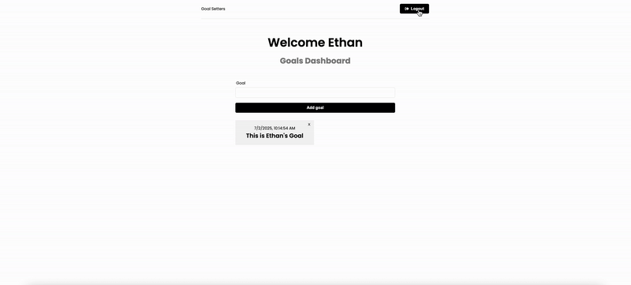
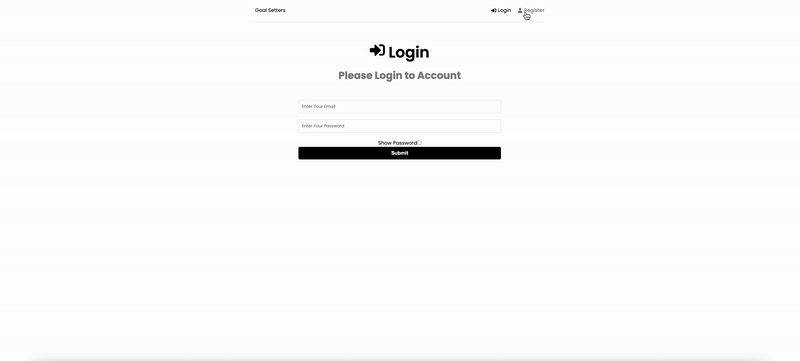
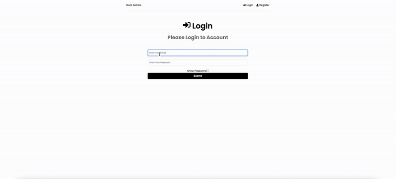

# 🎯 TaskAPP – Goal Tracking Application

**Live Demo:** [https://taskappburak-05321d7b7388.herokuapp.com/login](https://taskappburak-05321d7b7388.herokuapp.com/login)  
**Author:** [Burak Yildirim](https://github.com/burak2018ca)  
**Status:** In Progress 🚀

---

## 📌 Overview

**TaskAPP** is a full-stack goal management application designed to help users **set**, **view**, and **manage personal goals** with ease. It features **user authentication**, **real-time UI updates**, and **multi-user isolation**, all wrapped in a clean and minimalist interface.

This project showcases end-to-end development using the **MERN stack**, and reflects industry-standard practices in routing, form handling, authentication, CRUD operations, and user state management.

---

## 🧰 Tech Stack

| Layer       | Tech |
|------------|------|
| **Frontend** | React, Redux Toolkit, Tailwind CSS |
| **Backend** | Node.js, Express |
| **Database** | MongoDB + Mongoose |
| **Authentication** | JWT (JSON Web Tokens) |
| **Deployment** | Heroku (backend), GitHub Pages/Netlify (frontend) |

---

## ✨ Key Features

### 🔐 Authentication
- JWT-based login and registration  
- Secure, isolated access to goals per user  
- "Show Password" toggle for better UX  


---

### 🧾 Goal Management (CRUD)
- Add new goals with timestamps  
- Instantly delete goals with responsive UI  
- Live updates without page refresh  
  


---

### 👤 Multi-user Support
- Every user sees only their own goals  
- Switching users gives a fresh, isolated workspace  


---

### 🆕 User Registration
- Fully functional new user sign-up  
- Clean transition from register to login  
- Seamless experience  


---

### 🔁 Logout Functionality
- One-click logout  
- Clears token/localStorage  


---

### ❌ Login Error Handling (Planned UI enhancement)
- Currently, login failure lacks error feedback  
- This will be improved with toast notifications  


---

## 📚 What This Project Demonstrates

Hiring managers should note:
- **Full authentication flow (JWT)** from backend to frontend
- **Redux Toolkit** integration for state management
- **MongoDB schema design** for scalable goal tracking
- RESTful **API integration** and **async handling**
- **Reusable components** and clean Tailwind CSS styling
- Focus on **user experience** and **responsive interactivity**

---

## 🚀 Upcoming Improvements

| Feature | Status |
|--------|--------|
| 🧠 Auto-logout when browser closes unexpectedly | 🔧 In Development |
| 🚫 Deletion confirmation modal / undo | 🧠 Planned |
| 📣 Toast notifications (login error, success) | ⏳ Upcoming |
| 🧪 Jest/RTL unit and integration testing | ✅ Planned |
| 📱 Mobile responsive UI | 🚧 Partial |
| 🎨 Animation on add/delete cards | 🧠 In Review |
| 🧼 Demo user account with reset DB on logout | 🔒 To be added |
| 🛠️ Admin view (optional future extension) | 🧠 Conceptual |

---

## ✅ How to Run Locally

```bash
# Clone the repo
git clone https://github.com/burak2018ca/TaskAPP.git
cd TaskAPP

# Install client dependencies
cd frontend
npm install

# Install server dependencies
cd ../backend
npm install

# Set up .env file (sample below)
MONGO_URI=your_mongodb_uri
JWT_SECRET=your_jwt_secret

# Run both client and server (example)
npm run dev  # Or separate client/server scripts
```

---

## 🧠 Lessons Learned

- Working with **Redux Toolkit** taught clean, scalable state handling.
- Handling **JWT-based auth** across multiple users helped sharpen backend + frontend sync.
- Practiced best practices with **async/await**, error handling, and **component modularity**.
- Improved understanding of **user flow logic**, localStorage/session behavior, and UX-driven dev.

---

## 📫 Contact

If you’re a recruiter, I’d love to hear your thoughts!  
🔗 [LinkedIn – Burak Yildirim](https://www.linkedin.com/in/burak-yildirim-ca/)  
📧 burak.dev@example.com (replace with real email if public)
