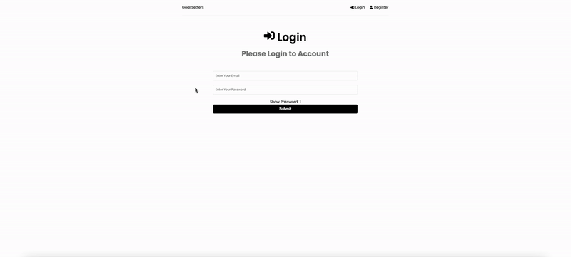
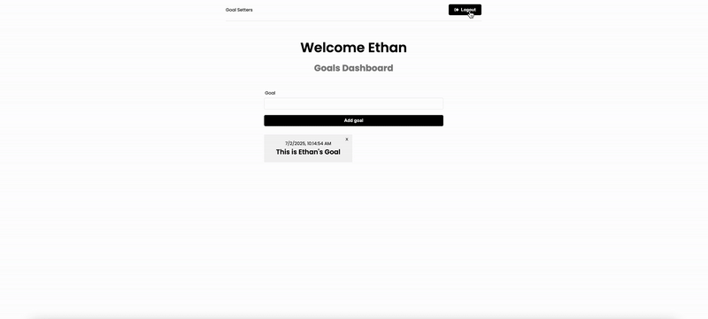

# 🎯 TaskAPP – Goal Tracking Application

**Live Demo:** [https://taskappburak-05321d7b7388.herokuapp.com/login](https://taskappburak-05321d7b7388.herokuapp.com/login)  
**Author:** [Burak Yildirim](https://github.com/burak2018ca)  
**Status:** In Progress 🚀

---

## 📌 Overview

**TaskAPP** is a full-stack goal management application designed to help users **set**, **view**, and **manage personal goals** with ease. It features **user authentication**, **real-time UI updates**, and **multi-user isolation**, all wrapped in a clean and minimalist interface.

This project showcases end-to-end development using the **MERN stack**, and reflects industry-standard practices in routing, form handling, authentication, CRUD operations, and user state management.

---

## 🧰 Tech Stack

| Layer       | Tech |
|------------|------|
| **Frontend** | React, Redux Toolkit, Tailwind CSS |
| **Backend** | Node.js, Express |
| **Database** | MongoDB + Mongoose |
| **Authentication** | JWT (JSON Web Tokens) |
| **Deployment** | Heroku (backend), GitHub Pages/Netlify (frontend) |

---

## 🧪 How to Test the App

You can test the application in two ways:

### 🧍 Option 1: Use Demo Login Credentials
- **Email:** `test@email.com`
- **Password:** `123`

This demo account already contains preloaded goals. Use it to explore the app instantly without creating a new user.

### ✍️ Option 2: Register Your Own Account
- Enter any name, fake email (e.g., `yourname@demo.com`), and a password 
- After signing up, you can log in and start adding goals. Each user has isolated data.

---

## ✨ Key Features

### 🔐 Authentication
- JWT-based login and registration  
- Secure, isolated access to goals per user  
- "Show Password" toggle for better UX  

---

### 🧾 Goal Management (CRUD)
- Add new goals with timestamps  
- Instantly delete goals with responsive UI  
- Live updates without page refresh  
  

---

### 👤 Multi-user Support
- Every user sees only their own goals  
- Switching users gives a fresh, isolated workspace  

---

### 🆕 User Registration
- Fully functional new user sign-up  
- Clean transition from register to login  
- Seamless experience  

---

### 🔁 Logout Functionality
- One-click logout  
- Clears token/localStorage  

---

### ❌ Login Error Handling (Planned UI enhancement)
- Currently, login failure lacks error feedback  
- This will be improved with toast notifications  

---

## 📚 What This Project Demonstrates

This project was built to reflect know and do in real-world jobs. It demonstrates hands-on proficiency in:

### 🔧 Frontend Engineering
- **React functional components** with hooks like `useEffect`, `useState`, and `useSelector`
- **Redux Toolkit** for scalable and maintainable global state management
- **Axios Toolkit** integration for clean and reusable API communication
- **Tailwind CSS** for fast and consistent styling with a responsive UI design
- UI decisions informed by UX principles — like live feedback, clear actions, and clean layout

### 🛠 Backend Engineering
- **Express.js** for routing and middleware structure
- **MongoDB + Mongoose** for modeling relational-style data in a NoSQL environment
- **JWT authentication** flow implemented securely across client and server
- **REST API design** for user and goal resource operations

### 🔐 Authentication & Access Control
- Full **user authentication system** (register, login, logout) using JWT
- **Secure user data isolation** — goals are scoped per user
- Sensitive routes are protected via custom **auth middleware**

### 🧪 Testing & Debugging Focus
- Designed to make debugging easy with clear API structure and modular logic
- Backend logs and client-side feedback allow smooth iteration during testing

### 💡 Project Thinking
- Clear **user journey**: register or login → create goals → manage/delete them → logout
- Clean separation of concerns between frontend logic, API services, and backend routing
- Built with readability, clarity, and recruiter-accessibility in mind

---

## 🚀 Upcoming Improvements

| Feature | Status |
|--------|--------|
| 🧠 Auto-logout when browser closes unexpectedly | 🔧 In Development |
| 🚫 Deletion confirmation modal / undo | 🧠 Planned |
| 📣 Toast notifications (login error, success) | ⏳ Upcoming |
| 🧪 Jest/RTL unit and integration testing | ✅ Planned |
| 📱 Mobile responsive UI | 🚧 Partial |
| 🎨 Animation on add/delete cards | 🧠 In Review |
| 🧼 Demo user account with reset DB on logout | 🔒 To be added |
| 🛠️ Admin view (optional future extension) | 🧠 Conceptual |

---

## 🧠 Lessons Learned

- Working with **Redux Toolkit** taught clean, scalable state handling.
- Using **Axios Toolkit** improved API abstraction and reduced boilerplate in HTTP calls.
- Handling **JWT-based auth** across multiple users helped sharpen backend + frontend sync.
- Practiced best practices with **async/await**, error handling, and **component modularity**.
- Improved understanding of **user flow logic**, localStorage/session behavior, and UX-driven dev.

---

## 📫 Contact

If you’re a recruiter, I’d love to hear your thoughts!  
🔗 [LinkedIn – Burak Yildirim](https://www.linkedin.com/in/burak-yildirim-ca/)  
📧 burak2018ca@hotmail.com
